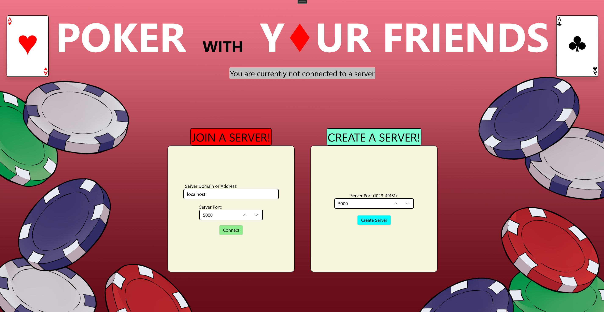
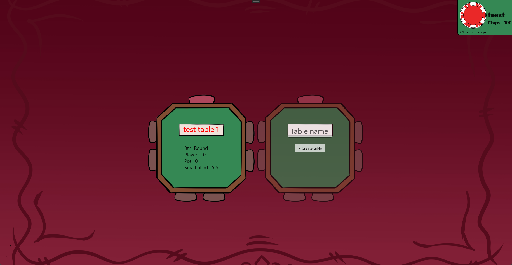
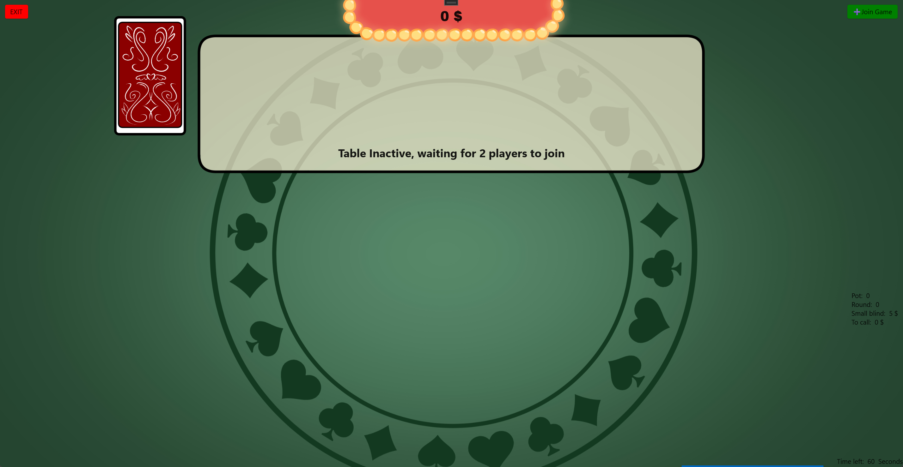
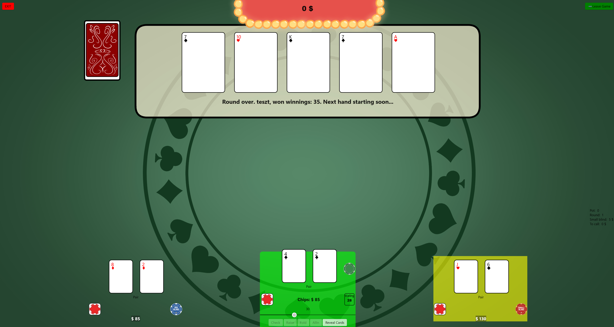
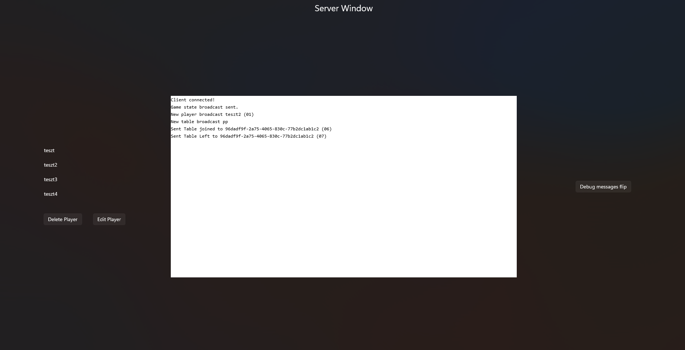

# Poker With Your Friends

**Texas Hold'em over the network — host a table, invite friends, and play in a custom WinUI desktop client.**

---

<p align="center">
  
  
  
  
  
</p>

---

## Overview

**Poker With Your Friends** is a native Windows multiplayer poker game designed for casual play with friends on the same network. One player hosts a TCP server; others connect as clients. Game state is synchronized in real time so every seat sees the same pot, community cards, blinds, and turn timers.

The project focuses on **systems software concerns** typical of computer engineering work: concurrent networking, framed protocol design, game-state consistency, and a clean separation between UI and domain logic.

---

## Screenshots

| Main menu | Lobby / game menu |
| :---: | :---: |
|  |  |

| Table in play | Showdown |
| :---: | :---: |
|  | <!--  --> |

| Server host window |
| :---: |
| <!--  --> |

---

## Features

- **Multiplayer Texas Hold'em** — blinds, betting rounds, all-ins, pot tracking, and showdowns
- **Host / join over TCP** — dedicated server process plus desktop clients on the LAN
- **Real-time table sync** — XML-serialized game state pushed to connected players
- **Hand evaluation engine** — ranks from high card through royal flush, with kicker comparison
- **Turn timers** — timed decisions with progress feedback in the UI
- **Custom table layout** — semicircle player seating panel for a table-centric view
- **Player profiles** — local player data and profile pictures
- **MVVM architecture** — WinUI views bound to ViewModels via CommunityToolkit.Mvvm

---

## Architecture

```
┌─────────────┐         TCP (framed messages)         ┌─────────────┐
│   Client    │◄─────────────────────────────────────►│    Server   │
│  (WinUI 3)  │         XML game / table state        │  (TCP host) │
└──────┬──────┘                                       └──────┬──────┘
       │                                                      │
       ▼                                                      ▼
┌─────────────┐                                        ┌─────────────┐
│ ViewModels  │                                        │ Game / Table│
│  + Views    │                                        │  + Players  │
└─────────────┘                                        └─────────────┘
```

| Layer | Role |
| --- | --- |
| **View** | WinUI 3 windows & pages (`MainWindow`, `GameWindow`, `InGamePage`, …) |
| **ViewModel** | UI state, commands, and bindings (CommunityToolkit.Mvvm) |
| **Model** | Poker rules, deck/hand logic, TCP client & server, timers |

Notable engineering pieces:

- Custom **TCP framing** with `System.IO.Pipelines` for efficient stream reads
- **Outbound message queues** so sends stay ordered under concurrency
- Server-authoritative **table logic** (actions, blinds, showdown flow)
- Custom **`SemicirclePlayerPanel`** layout for opponent seating
- **Hash checking** for profile pictures for optimal network performance
- Spectating and playing automatically handled at the same time by design

---

## Tech stack

| Area | Choice |
| --- | --- |
| Language | C# |
| UI | WinUI 3 / Windows App SDK |
| Runtime | .NET 10 (Windows) |
| Patterns | MVVM, Dependency Injection |
| Networking | TCP sockets, Pipelines |
| Serialization | XML |
| Tooling | CommunityToolkit.Mvvm, Microsoft.Extensions.DependencyInjection |

---

## Getting started

### Requirements

- Windows 10 version 1809+ (or Windows 11)
- [.NET 10 SDK](https://dotnet.microsoft.com/download)
- Visual Studio 2026 (recommended) with the **Windows App SDK** workload

### Quick start

Latest release available in releases tab

### Build & run

```bash
git clone https://github.com/Beszmi/Poker-With-Your-Friends.git
cd "Poker-With-Your-Friends"
dotnet build "Poker With Your Friends/Poker With Your Friends.csproj"
dotnet run --project "Poker With Your Friends/Poker With Your Friends.csproj"
```

Or open the solution in Visual Studio and press **F5**.

### Play with friends

1. Start the app and **host a server** (choose a port). (Open port on router if not on LAN)
2. On other PCs on the same network, **join** using the host IP and port.
3. Create or select a table, sit down, and play.

---

## Project structure

```
Poker With Your Friends/
├── Model/                 # Domain logic, networking, timers
│   ├── Game.cs
│   ├── Table.cs
│   ├── Hand.cs / Deck.cs / Card.cs
│   ├── Server.cs / Client.cs
│   └── ...
├── View/
│   ├── Windows/           # Main, Game, Server windows
│   ├── Pages/             # Lobby & in-game UI
│   └── Controls/          # Custom layout panels
├── ViewModel/             # MVVM layer
└── Assets/                # Cards, backgrounds, branding
```

---

## Skills demonstrated

- Desktop application design with **WinUI 3** and data binding
- **Client–server** protocol design over TCP
- Concurrent I/O and message queuing
- Domain modeling of a full **poker rules engine**
- Clean separation of concerns (**MVVM**)

---

## Possible ideas

- [ ] Polish UI animations and table feedback
- [ ] More robust reconnect / disconnect handling
- [ ] Chat function
- [ ] Packaged installer (MSIX)

---

## License

GPL-3.0

---

<p align="center">
  <sub>Built as a personal / portfolio project — multiplayer poker for friends on Windows.</sub>
</p>
